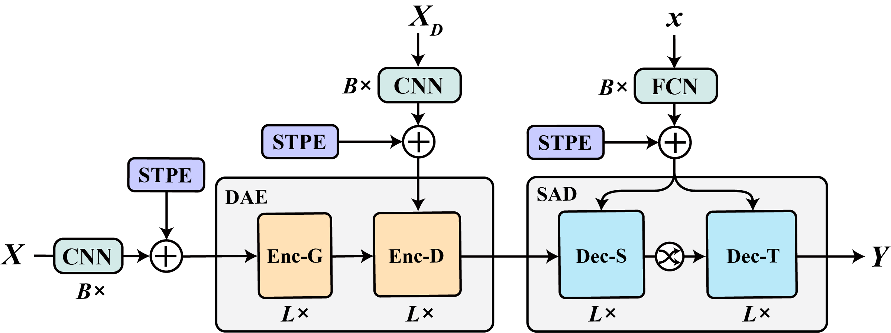

# DSAN (Dynamic Switch-Attention Network)

[1] Haoxing Lin, Rufan Bai, Weijia Jia, Xinyu Yang, Yongjian You. Preserving Dynamic Attention for Long-Term Spatial-Temporal Prediction. KDD 2020. Arxiv link: https://arxiv.org/abs/2006.08849

 
    @inproceedings{dsan,
        title={Preserving Dynamic Attention for Long-Term Spatial-Temporal Prediction},
        author={Haoxing Lin and Rufan Bai and Weijia Jia and Xinyu Yang and Yongjian You},
        booktitle={Proceedings of the 26th ACM SIGKDD Conference on Knowledge Discovery and Data Mining (KDD '20)},
        year={2020} 
    }


## 1. About DSAN

Dynamic Switch-Attention Network is designed to achieve effective long-term spatial-temporal prediction by filtering our spatial noise and alleviating long-term error propagation. It relies on attention mechanism instead of CNN or RNN to measure the spatial-temporal correlation. You are welcomed to check the technical details and experimental results in our paper.

Model architecture:

<p align="center">

</p>

## 2. Environments

**Quick install dependencies: ```pip install -r requirements.txt```**

Prerequisites:

 - Ubuntu Server 18.04 or later
 - Python 3.7
 - Tensorflow & Tensorflow-GPU: 2.2.0
 - CUDA 10.1
 - CUDNN 7.6.5


Docker is strongly recommended:

    docker pull tensorflow/tensorflow:2.2.0-gpu

We have tested our model on two different machines:

 1. A duo Intel(R) Xeon(R) Silver 4116 CPU @ 2.10GHz machine with 256G RAM and 4 NVIDIA RTX 2080 Ti GPUs
 2. NVIDIA DGX-2

We configured the dependencies on the first machine manually and used the docker mentioned above on NVIDIA DGX-2 without any modification. Both resulted in the same outcome, and the only difference is the training time. If you have problems configuring the environment, pulling the official docker image is recommended.

## 3. Pretrained DSAN Checkpoints

We have provided some pretrained checkpoints in the `checkpoints.zip` file with the corresponding training and testing logs. Checkpoints of other DSAN variants are coming soon.

Checkpoints info:

| Checkpoint | Dataset | #GPU | Batch Size | Mem per GPU | JT Weights |
| ------ | ------ | ------ | :------: | :------: | :------: |
| taxi-64x1 | Taxi-NYC | V100 x 1 | 64 | 4.8G | equal |
| taxi-256x2 | Taxi-NYC | V100 x 2 | 512 | 17.6G | equal |

** <em>JT Weights</em> denotes the setting of joint training weights.

You don't have to use the same GPUs listed here but to make sure that your GPU Mem is large enough.

If you train DSAN on your own data, the checkpoints would be saved after every epoch. If the program is killed accidentally before the training finished, you can set `remove_old_files` to `False` and run the program once again to continue from the last epoch.

## 4. Start training

Before running the model, unzip `data.zip`. Then run the following command to train the model with one GPU

    python3 main_1gpu.py

If you have multiple powerful GPUs, let's say 4 NVIDIA RTX 2080 Ti, you can run

    python3 main_4gpus.py

Actually, the two main files are basically the same. The differences are the settings of `gpu_ids`, `BATCH_SIZE`, `warmup_steps`, and `es_epoch` parameters. Technically, training on multiple GPUs is faster. On our first machine, using 1 GPU takes 9 ~ 16 hours while 4 GPUs take 3 ~ 5 hours. Of course, `BATCH_SIZE` also matters, setting it to `512` should apparently accelerate the training compared to `64`. Besides, the `warmup_steps` and `es_epoch` should be changed accordingly as well. You can also decide how many GPUs you want to use based on your own machine.

To use different data sets, run

    python3 main_1gpu.py --dataset=ctm  /* taxi, bike, ctm */

You can check the parameters by running

    python3 main_1gpu.py --help

or adjust them inside the `main` files.

## 5. Results, checkpoints, and Tensorboard

When running DSAN, the results of training, evaluation, and testing are automatically written into a `txt` file in `results` folder. Besides, the model also executes `summary_write` to create Tensorboard output in `tensorboard` folder. The checkpoints mentioned above are delivered to `checkpoints` folder.

## 6. Train on your own data

If you want to use your own data, you can check the `utils/dataloader.py` and `data_parameters.py` files and see how to preprocess your own data. Basically, DSAN requires 7 inputs:

 - dae_inp_g: Enc-G input, shape: (batch_size, his_time_step, height_g, width_g, features)
 - dae_inp: Enc-D input, shape: (batch_size, his_time_step, height_d, width_d, features)
 - dae_inp_ex: external information. If you don't have any, just use the one-hot time vectors, shape: (batch_size, his_time_step, one_hot)
 - sad_inp: SAD input, shape: (batch_size, future_time_step, features)
 - sad_inp_ex: external information for `sad_inp`, shape: (batch_size, future_time_step, one_hot)
 - cors_g
 - cors

`cors_g` and `cors` are the coordinate matrices generated by our model automatically, which are used for producing the spatial positional encoding. To make sure they are generated correctly, the only thing you need to do is to specify the information of your own data in `data_parameters.py`.
